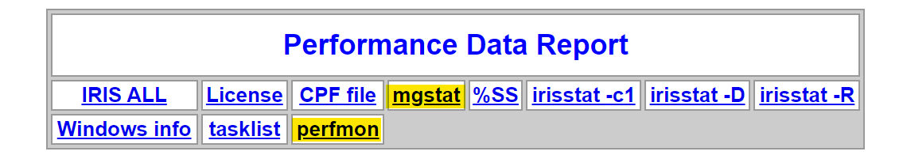
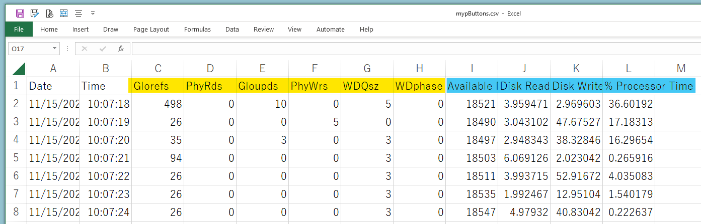
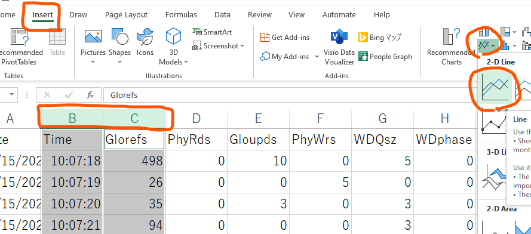
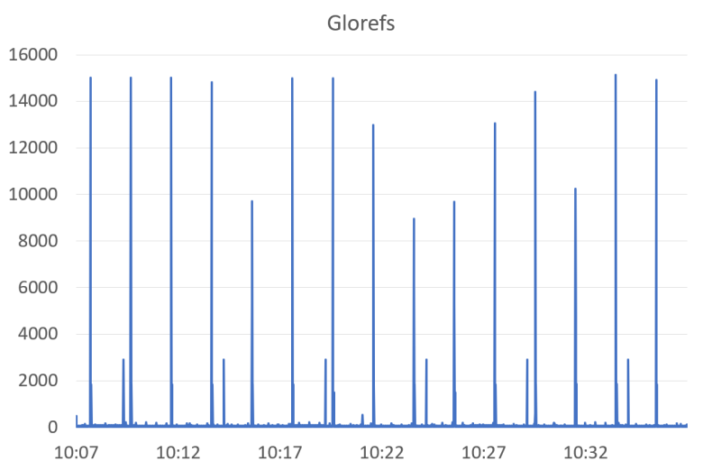
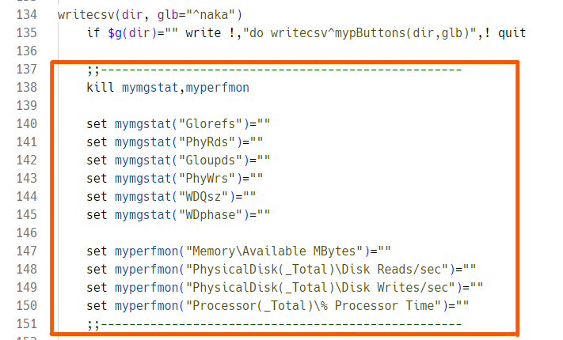

# mypButtons
mypButtons routine creates one CSV (mgstat and Windows Performance are shown in one line) from multiple pButtons HTML files. This routine works only for Windows.

# Background
InterSystems IRIS family has a nice utility **^SystemPerformance** (as known as **^pButtons** in Caché and Ensemble) which outputs the database performance information into a readable HTML file. When you run ^SystemPerformance on IRIS for Windows, a HTML file is created where both our own performance log *mgstat* and Windows performance log are included.

It's a great report, however, you need to extract log sections manually from a HTML file and paste them to a spreadsheet editor like Excel to create a performance visual graph. Many developers already share useful tips and utilities to do it [here](https://community.intersystems.com/post/intersystems-data-platforms-capacity-planning-and-performance-series-index "InterSystems Data Platforms Capacity Planning and Performance Series Index").

Now I introduce a new utiltiy **^mypButtons**!

# What's new compared to other tools
* **^mypButtons** combines mgstat and Windows performnace logs in one line. For instance, you can create a graph includes both "PhyWrs" (mgstat) and "Disk Writes/sec" (Win perfmon) in the same time frame.
* **^mypButtons** reads multiple HTML files at once and generates a single combined CSV file.
* **^mypButtons** generates a single CSV file into your laptop so it's much easier to crete your graph as you like.
* **^mypButtons** generates a CSV and it includes columns which I strongly recommend to check as the first step to see the performance of InterSystems product. So everyone can enjoy a peformance graph with this utility so easily!

***Please Note!*** If you want to play mypButtons.csv, please load SystemPerformance HTML files with "every 1 second" profile.

# How to run
> do readone^mypButtons("C:\temp\dir\myserver_IRIS_20230522_130000_8hours.html","^||naka")

It reads one SystemPerformance HTML file and store the information into a given global. In this sample, it reads *myserver_IRIS_20230522_130000_8hours.html* and store it into *^||naka*.

> do readdir^mypButtons("C:\temp\dir\","^||naka")

It reads all of SystemPerformance HTML files under a given folder and store the information into a given global. In this sample, it reads all HTML files under *C:\temp\dir* and store it into *^||naka*.

> do writecsv^mypButtons("C:\temp\csv\","^||naka")

It generates the following three csv files under a given folder from a given global. 
* mgstat.csv
* perfmon.csv
* mypButtons.csv

Here, mypButtons.csv includes the following columns by default, which I strongly recommend to check first to see the performance:
* mgstat:  Glorefs, PhyRds, Gloupds, PhyWrs, WDQsz, WDphase
* perfmon: Available MBytes, Disk Reads/sec, Disk Writes/sec, % Processor Time

This utility works for InterSystems IRIS, InterSystems IRIS for Health, Caché and Ensemble for Windows.

# Example steps to create your IRIS server's performance graph with ^mypButtons
(1) First, run ^SystemPerformance to record both our own performance tool *mgstat* and Windows peformance monitor *perfmon*. By default, InterSystems IRIS has some profiles so you can enjoy it soon. Try this from IRIS terminal.
> %SYS> **do ^SystemPerformance**  
Current log directory: c:\intersystems\iris\mgr\  
Windows Perfmon data will be left in raw format.  
Available profiles:  
　　1 12hours - 12-hour run sampling every 10 seconds   
　　2 24hours - 24-hour run sampling every 10 seconds   
　　**3 30mins  - 30-minute run sampling every 1 second**   
　　4 4hours  - 4-hour run sampling every 5 seconds   
　　5 8hours  - 8-hour run sampling every 10 seconds   
　　6 test    - 5-minute TEST run sampling every 30 seconds  
select profile number to run: **3**

***Please Note!*** If you want to play mypButtons.csv, please use "every 1 second" profile. By default, you will see "30 mins" profile which samples every 1 second. If you want to create another profiles, see [our documentation](https://docs.intersystems.com/irislatest/csp/docbook/Doc.View.cls?KEY=GCM_systemperf "Monitoring Performance Using ^SystemPerformance") for more details.  

(2) After sampling, one HTML will be generated under *irisdir*\mgr, whose name is like *JP7320NAKAHASH_IRIS_20231115_100708_30mins.html*. Open a generated HTML, and you will see a lot of performance comma separated data under **mgstat** and **perfmon** section.

(3) Load it with *^mypButtons* as below.
> USER> **do readone^mypButtons("C:\InterSystems\IRIS\mgr\JP7320NAKAHASH_IRIS_20231115_100708_30mins.html","^||naka")**

This will load HTML in the first parameter and save the performance data into the global in the second parameter.

(4) Generate CSV witl *^mypButtons* as below.
> USER> **do writecsv^mypButtons("C:\temp\","^||naka")**

This will output three CSV files under the folder in the first parameter from the global in the second parameter. Open mypButtons.csv in the excel, and you can see mgstat and perfmon is in the same line every second. See this screenshot - yellow highlighted columns are mgstat and blue highlighted columns are perfmon.

(5) Let's create a simple graph from this CSV. It's so easy. Choose column B *Time* and column C *Glorefs*, select *Insert* menu, 2-D Line graphs as below.

This graph will show you "Global Refernce numbers per second" information. Sorry, there were very few activities in my IRIS instance so my sample graph does not excite you, but I do believe this graph from the production server will tell you a lot of useful information!

(6) mypButtons.csv includes selected columns which I think you should check first. [Murray's article series](https://community.intersystems.com/post/intersystems-data-platforms-capacity-planning-and-performance-series-index) will tell you why these columns are important to see the performance.

# Edit **^mypButtons** for reporting columns
If you want to change columns which are reported into mypButtons.csv, please modify writecsv label manually. It reports columns which are defined in this area.

